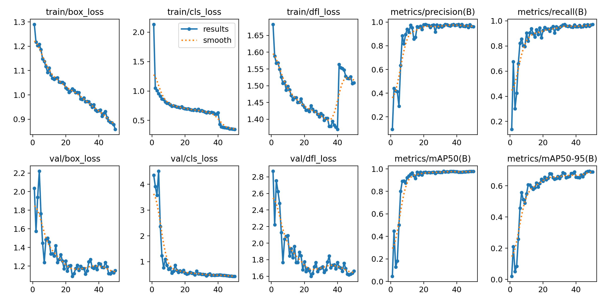
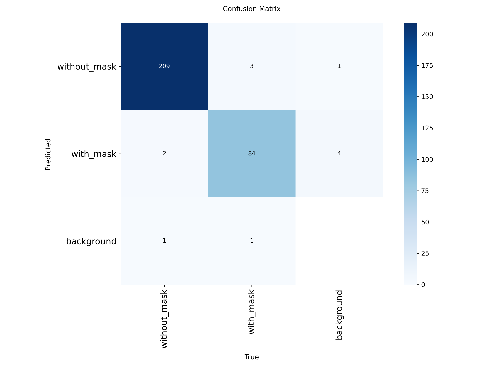
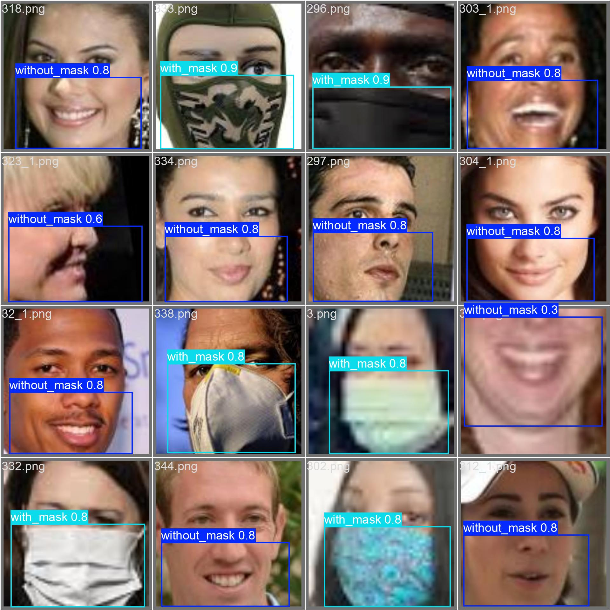

````markdown
# YOLO-based Mask Detection

以 YOLOv8 建立口罩佩戴狀態偵測模型，辨識 `with_mask` 與 `without_mask` 兩類目標。

本專案源自數位影像處理課程實作，內容涵蓋影像資料整理、LabelImg 人工邊界框標註、YOLO 格式資料建置、YOLOv8 模型訓練、驗證與測試、影像推論，以及 IoU／NMS 原理實作。


## 專案重點

- 原始影像取自 Kaggle「Face Mask Detection ~12K Images Dataset」。
- 原始資料主要依 `WithMask`／`WithoutMask` 類別整理。
- 為進行物件偵測，使用 LabelImg 手動建立人臉區域與口罩狀態的邊界框標註。
- 本次實驗實際整理 2,002 張具有 YOLO 格式標註的影像。
- 資料切分為 Train 1,401 張、Validation 300 張、Test 301 張。
- 使用相同資料與 50 epochs 設定比較 YOLOv8n 與 YOLOv8s。
- 使用 Precision、Recall、mAP@50 與 mAP@50–95 評估模型。
- 以獨立 Python 程式整理訓練、評估與推論流程。
- 另行實作 IoU 與簡化版 Non-Maximum Suppression，理解偵測框篩選機制。

---

## 資料集與標註來源

原始影像來源：

- Ashish Jangra
- **Face Mask Detection ~12K Images Dataset**
- Kaggle：https://www.kaggle.com/datasets/ashishjangra27/face-mask-12k-images-dataset

原始資料主要以 `WithMask` 與 `WithoutMask` 類別整理。

本專案為了進行 YOLO 物件偵測，另外使用 LabelImg 手動建立人臉區域的 bounding box，並依口罩佩戴狀態設定類別標籤，再整理為 YOLO 格式。

本次實驗實際使用的資料量如下：

| 子集合 | 影像數 | YOLO 標註檔數 |
|---|---:|---:|
| Train | 1,401 | 1,401 |
| Validation | 300 | 300 |
| Test | 301 | 301 |
| **總計** | **2,002** | **2,002** |

YOLO 標註類別為：

| class_id | label |
|---:|---|
| 0 | `without_mask` |
| 1 | `with_mask` |

每個標註檔皆使用 YOLO bounding-box 格式：

```text
class_id x_center y_center width height
```

其中 `x_center`、`y_center`、`width` 與 `height` 均正規化至 0–1。

例如：

```text
0 0.495798 0.752101 0.857143 0.495798
```

完整原始影像、2,002 份完整標註檔及模型權重未放入公開 repository，以避免重新散布大型資料並保留資料授權界線。

本 repository 主要提供：

- 模型訓練程式
- 模型評估程式
- 推論程式
- 資料整理程式
- YOLO 設定範例
- 實驗成果圖
- IoU／NMS 原理實作
- 專案執行方式

> **注意**
>
> `src/prepare_dataset.py` 不會自動建立或產生 bounding-box annotation。
>
> 使用者必須先準備 YOLO 格式的 `.txt` 標註檔，並確保標註檔與對應影像具有完全相同的檔名主體。
>
> 例如：
>
> `1234.png` ↔ `1234.txt`
>
> `5678_1.jpg` ↔ `5678_1.txt`

詳細資料格式請參考 [`dataset/README.md`](dataset/README.md)。

---

## 實驗設定

| 項目 | 設定 |
|---|---|
| Framework | Ultralytics YOLOv8 |
| Models | YOLOv8n、YOLOv8s |
| Epochs | 50 |
| Image size | 640 × 640 |
| Batch size | 32 |
| Classes | `without_mask`、`with_mask` |
| Hardware | Google Colab GPU（可用時） |

---

## 實驗結果

以下數值來自保存的 `best.pt`，分別在 Validation 與 Test split 重新評估。

| Model | Split | Precision | Recall | mAP@50 | mAP@50–95 |
|---|---|---:|---:|---:|---:|
| YOLOv8n | Validation | 0.977 | 0.954 | 0.972 | 0.695 |
| YOLOv8n | Test | 0.969 | 0.957 | 0.967 | 0.657 |
| YOLOv8s | Validation | 0.977 | 0.959 | 0.977 | 0.694 |
| YOLOv8s | Test | 0.959 | 0.975 | 0.978 | 0.657 |

YOLOv8s 在 Test split 的 Recall 與 mAP@50 較高，但兩者的 mAP@50–95 相同。

因此，在本次資料與訓練設定下，未觀察到較大模型在 mAP@50–95 指標上的明顯提升。

若進一步考慮實際部署，仍需加入：

- 推論延遲
- 模型大小
- GPU／CPU 資源需求
- 邊緣裝置效能

等指標進行比較。

---

### 訓練曲線



### 混淆矩陣



### Validation 預測結果



---

## Repository 結構

```text
.
├── assets/
│   ├── sample_prediction.jpg
│   ├── results_yolov8s.png
│   ├── confusion_matrix_yolov8s.png
│   └── val_predictions_yolov8s.jpg
│
├── config/
│   └── data.example.yaml
│
├── dataset/
│   └── README.md
│
├── src/
│   ├── evaluate.py
│   ├── nms_demo.py
│   ├── predict.py
│   ├── prepare_dataset.py
│   └── train.py
│
├── .gitignore
├── requirements.txt
└── README.md
```

各程式用途如下：

- `train.py`：YOLOv8 模型訓練
- `evaluate.py`：Validation／Test 評估
- `predict.py`：影像、資料夾或影片推論
- `prepare_dataset.py`：依既有 YOLO label 檔名尋找並整理對應影像
- `nms_demo.py`：IoU 與簡化版 Non-Maximum Suppression 原理實作

---

## 快速開始

### 1. 建立 Python 環境

```bash
python -m venv .venv
```

Windows：

```bash
.venv\Scripts\activate
```

安裝套件：

```bash
pip install -r requirements.txt
```

---

### 2. 準備資料集

資料格式：

```text
yolo_dataset/
├── images/
│   ├── train/
│   ├── val/
│   └── test/
│
└── labels/
    ├── train/
    ├── val/
    └── test/
```

使用者需自行準備既有 YOLO 標註檔：

```text
labels/train/
labels/val/
labels/test/
```

每個標註檔必須與對應影像使用相同檔名主體。

例如：

```text
images/train/1234.png
labels/train/1234.txt
```

以及：

```text
images/val/5678_1.jpg
labels/val/5678_1.txt
```

若標註檔已依 Train／Validation／Test 分類完成，但影像仍集中在另一個來源資料夾，可執行：

```bash
python src/prepare_dataset.py \
  --dataset-root path/to/yolo_dataset \
  --source-images path/to/source_images
```

`prepare_dataset.py` 會：

1. 讀取 `labels/train`、`labels/val`、`labels/test` 中既有的 `.txt` 標註檔。
2. 取得每個標註檔的檔名主體。
3. 在來源影像資料夾中尋找同名影像。
4. 將影像複製至對應的 `images/train`、`images/val` 或 `images/test`。

若找不到對應影像，程式會產生：

```text
missing_images.tsv
```

開始訓練前應先確認：

- 每個 label 都有對應影像
- image 與 label 的檔名主體完全一致
- `data.yaml` 路徑正確
- 類別順序與設定一致

---

### 3. 建立 data.yaml

複製：

```text
config/data.example.yaml
```

為：

```text
config/data.yaml
```

並修改資料集路徑：

```yaml
path: /absolute/path/to/yolo_dataset
```

目前類別設定為：

```yaml
names:
  0: without_mask
  1: with_mask
```

---

### 4. 模型訓練

YOLOv8s：

```bash
python src/train.py \
  --data config/data.yaml \
  --model yolov8s.pt \
  --epochs 50
```

若 GPU 記憶體不足，可降低 batch size。

例如：

```bash
python src/train.py \
  --data config/data.yaml \
  --model yolov8s.pt \
  --epochs 50 \
  --batch 16
```

YOLOv8n 可將模型改為：

```text
yolov8n.pt
```

---

### 5. 模型評估

Validation：

```bash
python src/evaluate.py \
  --weights runs/mask_detection/yolov8s/weights/best.pt \
  --data config/data.yaml \
  --split val
```

Test：

```bash
python src/evaluate.py \
  --weights runs/mask_detection/yolov8s/weights/best.pt \
  --data config/data.yaml \
  --split test
```

---

### 6. 模型推論

可對單張圖片、資料夾或影片進行推論：

```bash
python src/predict.py \
  --weights runs/mask_detection/yolov8s/weights/best.pt \
  --source path/to/image_or_video
```

---

## IoU 與 NMS 實作

除了直接使用 Ultralytics YOLOv8，本專案另外實作 IoU 與簡化版 Non-Maximum Suppression，用來理解物件偵測中候選框篩選的基本原理。

執行：

```bash
python src/nms_demo.py
```

此程式主要作為原理理解與實驗用途，並非取代 YOLOv8 內部完整的後處理流程。

---

## 已知限制與後續方向

目前專案仍有以下限制：

- 原始影像與完整人工標註資料未放入公開 repository。
- 現有 Test 資料與 Train 資料來自相同影像來源，跨資料來源的泛化能力仍需另外驗證。
- `with_mask`／`without_mask` 僅涵蓋兩類，尚未獨立處理口罩配戴不正確的情況。
- 現有評估主要使用 Precision、Recall、mAP@50 與 mAP@50–95。
- 尚未完整比較模型推論延遲、模型大小與硬體資源需求。
- 尚未系統整理錯誤偵測案例及誤判原因。
- 目前 repository 不提供即時多人追蹤功能。

後續可進一步加入：

- 攝影機即時推論
- 邊緣裝置部署
- 跨資料集測試
- 推論速度與模型大小比較
- False Positive／False Negative 案例分析
- 更多口罩佩戴狀態分類

---

## 技術工具

- Python
- PyTorch
- Ultralytics YOLOv8
- LabelImg
- PyYAML
- Google Colab
````
