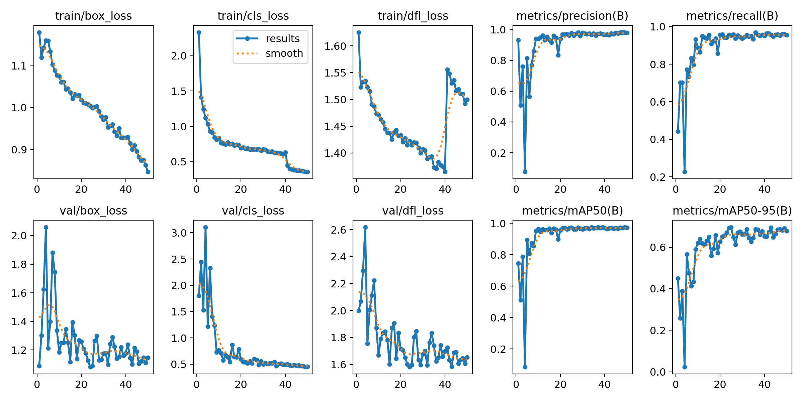
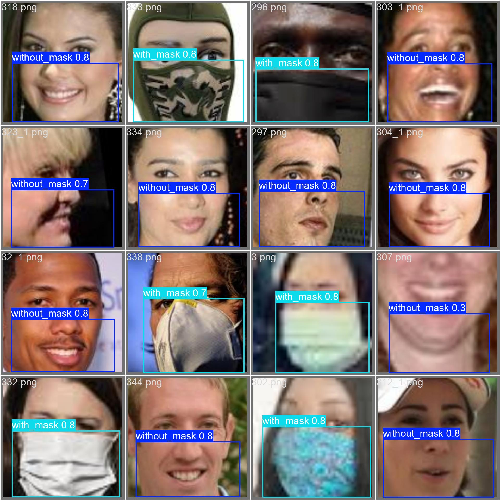

# YOLO-based Mask Detection

以 **YOLOv8** 建立口罩佩戴狀態物件偵測模型，辨識 `with_mask` 與 `without_mask` 兩類目標，並比較 **YOLOv8n** 與 **YOLOv8s** 在相同資料與訓練設定下的偵測表現。

本專案源自數位影像處理課程實作，完整流程包含影像資料整理、LabelImg 人工邊界框標註、YOLO 格式資料建置、模型訓練、Validation／Test 評估、影像推論，以及 IoU 與 Non-Maximum Suppression（NMS）原理實作。


---

## 專案重點

* 使用 Kaggle **Face Mask Detection ~12K Images Dataset** 作為原始影像來源。
* 使用 LabelImg 手動建立人臉區域 Bounding Box 與口罩狀態標註。
* 實際整理 **2,002 張具有 YOLO 格式標註的影像**。
* 資料切分為 Train 1,401 張、Validation 300 張、Test 301 張。
* 使用相同資料與 **50 epochs** 設定比較 YOLOv8n 與 YOLOv8s。
* 使用 Precision、Recall、mAP@50 與 mAP@50–95 評估模型。
* 分別保留 YOLOv8n 與 YOLOv8s 的訓練曲線、混淆矩陣與 Validation 預測結果，作為實驗證據。
* 以獨立 Python 程式整理訓練、模型評估、推論與資料整理流程。
* 另外實作 IoU 與簡化版 Non-Maximum Suppression，理解物件偵測候選框篩選原理。

---

## 專案流程

本專案的主要實作流程如下：

```text
原始影像資料
      │
      ▼
LabelImg 人工 Bounding Box 標註
      │
      ▼
轉換／整理為 YOLO Dataset
      │
      ├── Train
      ├── Validation
      └── Test
      │
      ▼
YOLOv8n / YOLOv8s 模型訓練
      │
      ▼
Validation / Test 評估
      │
      ├── Precision
      ├── Recall
      ├── mAP@50
      └── mAP@50–95
      │
      ▼
預測結果與錯誤觀察
```

除了模型本身的訓練與推論，本專案也將資料整理、模型評估與預測流程拆分成獨立程式，以降低單一 Notebook 或單一腳本內流程過度耦合的問題。

---

# 資料集與標註

## 原始資料來源

原始影像來源：

* Ashish Jangra
* **Face Mask Detection ~12K Images Dataset**
* Kaggle：https://www.kaggle.com/datasets/ashishjangra27/face-mask-12k-images-dataset

原始資料主要依照 `WithMask` 與 `WithoutMask` 類別整理。

然而，分類資料本身無法直接用於 YOLO 物件偵測，因此本專案另外使用 **LabelImg** 手動建立人臉區域的 Bounding Box，並依照口罩佩戴狀態指定類別，再整理成 YOLO Object Detection 格式。

---

## 資料量

本次實驗實際使用的資料如下：

| 子集合        |       影像數 | YOLO 標註檔數 |
| ---------- | --------: | --------: |
| Train      |     1,401 |     1,401 |
| Validation |       300 |       300 |
| Test       |       301 |       301 |
| **總計**     | **2,002** | **2,002** |

YOLO 類別設定：

| class_id | label          |
| -------: | -------------- |
|        0 | `without_mask` |
|        1 | `with_mask`    |

---

## YOLO 標註格式

每個影像對應一個 `.txt` 標註檔，格式為：

```text
class_id x_center y_center width height
```

其中：

* `x_center`
* `y_center`
* `width`
* `height`

皆正規化至 0–1。

例如：

```text
0 0.495798 0.752101 0.857143 0.495798
```

代表該 Bounding Box 的類別為 `without_mask`。

---

## 公開資料說明

完整原始影像、2,002 份完整人工標註檔，以及模型訓練權重未直接放入本 repository。

主要考量包括：

1. 避免重新散布原始大型資料集。
2. 保留原始資料來源與授權界線。
3. 避免 Git repository 因大量資料與模型權重而過度膨脹。
4. 將 repository 重點放在程式流程、實驗方法與可驗證的實驗結果。

本 repository 主要提供：

* 模型訓練程式
* 模型評估程式
* 模型推論程式
* 資料整理程式
* YOLO Dataset 設定範例
* YOLOv8n 實驗成果圖
* YOLOv8s 實驗成果圖
* IoU／NMS 原理實作
* 專案執行方式與資料格式說明

詳細資料格式可參考：

[`dataset/README.md`](dataset/README.md)

---

# 實驗設定

為降低比較過程中的其他變因，YOLOv8n 與 YOLOv8s 使用相同資料切分與主要訓練設定。

| 項目         | 設定                         |
| ---------- | -------------------------- |
| Framework  | Ultralytics YOLOv8         |
| Models     | YOLOv8n、YOLOv8s            |
| Epochs     | 50                         |
| Image size | 640 × 640                  |
| Batch size | 32                         |
| Classes    | `without_mask`、`with_mask` |
| Hardware   | Google Colab GPU（可用時）      |

主要比較目的是觀察在目前資料量與訓練條件下，模型規模增加是否能帶來明顯的偵測效能提升。

---

# 實驗結果

以下數值來自各模型保存的 `best.pt`，再分別使用 Validation 與 Test split 進行評估。

| Model   | Split      | Precision | Recall | mAP@50 | mAP@50–95 |
| ------- | ---------- | --------: | -----: | -----: | --------: |
| YOLOv8n | Validation |     0.977 |  0.954 |  0.972 |     0.695 |
| YOLOv8n | Test       |     0.969 |  0.957 |  0.967 |     0.657 |
| YOLOv8s | Validation |     0.977 |  0.959 |  0.977 |     0.694 |
| YOLOv8s | Test       |     0.959 |  0.975 |  0.978 |     0.657 |

從 Test split 可觀察到：

* YOLOv8n Precision：**0.969**
* YOLOv8s Precision：**0.959**
* YOLOv8n Recall：**0.957**
* YOLOv8s Recall：**0.975**
* YOLOv8n mAP@50：**0.967**
* YOLOv8s mAP@50：**0.978**
* 兩模型 mAP@50–95 均為 **0.657**

YOLOv8s 在 Test split 的 Recall 與 mAP@50 較高，而 YOLOv8n 的 Precision 略高。

但在較嚴格、同時考慮多個 IoU threshold 的 **mAP@50–95** 指標中，兩者皆為 0.657。

因此，在本次資料與訓練條件下，並未觀察到 YOLOv8s 相較 YOLOv8n 在 mAP@50–95 上具有明顯優勢。

這也表示模型規模增加並不必然在特定資料集上直接轉化成同等幅度的準確率提升。

若進一步討論實際部署價值，仍應加入：

* 推論延遲
* FPS
* 模型大小
* GPU／CPU 使用量
* 記憶體需求
* 邊緣裝置效能

才能進行更完整的模型選擇。

---

# YOLOv8n 實驗證據

## 訓練曲線

以下為 YOLOv8n 在 50 epochs 訓練過程中的 Loss 與主要評估指標變化。



透過訓練曲線可觀察 Bounding Box Loss、Classification Loss，以及 Precision、Recall 與 mAP 等指標隨 Epoch 的變化，並用於確認模型是否正常收斂。

---

## 混淆矩陣


混淆矩陣用於觀察 `with_mask` 與 `without_mask` 類別間的預測情況，以及模型可能出現的 False Positive 與 False Negative。

---

## Validation 預測結果



圖中顯示 YOLOv8n 對 Validation Batch 進行物件偵測後的實際 Bounding Box 與類別預測結果。

---

# YOLOv8s 實驗證據

## 訓練曲線

以下為 YOLOv8s 在相同訓練設定下的結果。


---

## 混淆矩陣


---

## Validation 預測結果


透過保留 YOLOv8n 與 YOLOv8s 的完整視覺化結果，可直接比較兩種模型，而非僅以最終單一 mAP 數值作為模型表現依據。

---

# 推論成果範例

除 Validation Batch 外，也另外保留單張影像推論結果：


模型會輸出：

* 預測類別
* Bounding Box
* Confidence Score

作為實際推論結果。

---

# Repository 結構

```text
.
├── assets/
│   ├── confusion_matrix_yolov8n.png
│   ├── confusion_matrix_yolov8s.png
│   ├── results_yolov8n.png
│   ├── results_yolov8s.png
│   ├── sample_prediction.jpg
│   ├── val_predictions_yolov8n.jpg
│   └── val_predictions_yolov8s.jpg
│
├── config/
│   └── data.example.yaml
│
├── dataset/
│   └── README.md
│
├── src/
│   ├── evaluate.py
│   ├── nms_demo.py
│   ├── predict.py
│   ├── prepare_dataset.py
│   └── train.py
│
├── .gitignore
├── requirements.txt
└── README.md
```

主要程式用途：

| 程式                   | 功能                    |
| -------------------- | --------------------- |
| `train.py`           | YOLOv8 模型訓練           |
| `evaluate.py`        | Validation／Test 模型評估  |
| `predict.py`         | 圖片、資料夾或影片推論           |
| `prepare_dataset.py` | 依既有 YOLO Label 整理對應影像 |
| `nms_demo.py`        | IoU 與簡化版 NMS 原理實作     |

---

# 快速開始

## 1. 建立 Python 環境

建立 Virtual Environment：

```bash
python -m venv .venv
```

Windows：

```bash
.venv\Scripts\activate
```

安裝套件：

```bash
pip install -r requirements.txt
```

---

# 2. 準備資料集

預期資料格式：

```text
yolo_dataset/
├── images/
│   ├── train/
│   ├── val/
│   └── test/
│
└── labels/
    ├── train/
    ├── val/
    └── test/
```

使用者必須先準備既有 YOLO Bounding Box 標註檔：

```text
labels/train/
labels/val/
labels/test/
```

每個標註檔必須與對應影像使用完全相同的檔名主體。

例如：

```text
images/train/1234.png
labels/train/1234.txt
```

以及：

```text
images/val/5678_1.jpg
labels/val/5678_1.txt
```

---

## prepare_dataset.py 的作用

`src/prepare_dataset.py` **不會自動產生 Bounding Box 標註**。

Bounding Box 必須事先透過 LabelImg 或其他標註工具建立。

如果標註檔已經依照 Train／Validation／Test 分類完成，但影像仍集中在另一個來源資料夾，可執行：

```bash
python src/prepare_dataset.py \
  --dataset-root path/to/yolo_dataset \
  --source-images path/to/source_images
```

程式會：

1. 讀取 `labels/train`、`labels/val`、`labels/test` 中既有的 `.txt` 標註。
2. 取得每個標註檔的檔名主體。
3. 在來源影像資料夾中尋找同名影像。
4. 將影像複製至對應的 `images/train`、`images/val` 或 `images/test`。

例如：

```text
1234.txt
```

會尋找：

```text
1234.jpg
1234.jpeg
1234.png
```

等可能的同名影像。

若找不到影像，程式會產生：

```text
missing_images.tsv
```

供後續檢查。

開始模型訓練前應確認：

* 每個 Label 都有對應影像。
* Image 與 Label 檔名主體完全一致。
* Train／Validation／Test 分類正確。
* `data.yaml` 路徑設定正確。
* 類別編號與類別名稱順序一致。

---

# 3. 建立 data.yaml

將：

```text
config/data.example.yaml
```

複製為：

```text
config/data.yaml
```

再依照實際資料集位置修改：

```yaml
path: /absolute/path/to/yolo_dataset
```

類別設定：

```yaml
names:
  0: without_mask
  1: with_mask
```

---

# 4. 模型訓練

## YOLOv8n

```bash
python src/train.py \
  --data config/data.yaml \
  --model yolov8n.pt \
  --epochs 50
```

## YOLOv8s

```bash
python src/train.py \
  --data config/data.yaml \
  --model yolov8s.pt \
  --epochs 50
```

若 GPU 記憶體不足，可降低 Batch Size：

```bash
python src/train.py \
  --data config/data.yaml \
  --model yolov8s.pt \
  --epochs 50 \
  --batch 16
```

---

# 5. 模型評估

## Validation

```bash
python src/evaluate.py \
  --weights runs/mask_detection/yolov8s/weights/best.pt \
  --data config/data.yaml \
  --split val
```

## Test

```bash
python src/evaluate.py \
  --weights runs/mask_detection/yolov8s/weights/best.pt \
  --data config/data.yaml \
  --split test
```

若要評估 YOLOv8n，只需將 `--weights` 改為 YOLOv8n 對應的 `best.pt`。

---

# 6. 模型推論

可對單張圖片、圖片資料夾或影片執行推論：

```bash
python src/predict.py \
  --weights runs/mask_detection/yolov8s/weights/best.pt \
  --source path/to/image_or_video
```

推論完成後可取得模型辨識類別、Bounding Box 與 Confidence Score。

---

# IoU 與 NMS 實作

除了直接使用 Ultralytics YOLOv8，本專案另外實作 **Intersection over Union（IoU）** 與簡化版 **Non-Maximum Suppression（NMS）**。

執行：

```bash
python src/nms_demo.py
```

## IoU

IoU 用來衡量兩個 Bounding Box 的重疊程度：

```text
IoU = Intersection Area / Union Area
```

IoU 越高，代表兩個 Bounding Box 的重疊程度越高。

---

## Non-Maximum Suppression

物件偵測模型可能對同一個目標輸出多個高度重疊的候選框。

NMS 的基本處理流程為：

1. 依 Confidence Score 排序候選框。
2. 保留 Confidence 最高的 Bounding Box。
3. 計算其餘 Bounding Box 與該框的 IoU。
4. 移除 IoU 超過設定 Threshold 的重複候選框。
5. 重複上述流程。

本專案中的 `nms_demo.py` 主要用於理解物件偵測後處理原理，並非取代 Ultralytics YOLOv8 內部完整的 NMS 流程。

---

# 專案觀察

本次實驗中，YOLOv8n 與 YOLOv8s 在相同資料切分與訓練 Epoch 下，都能取得較高的 Precision、Recall 與 mAP@50。

YOLOv8s 在 Test split 中取得較高的 Recall 與 mAP@50，但 YOLOv8n 在 Precision 上略高。

更值得注意的是，兩者的 Test mAP@50–95 都為 **0.657**。

因此，本次結果不能單純解讀為「模型越大一定越好」。

在特定資料量與任務複雜度下，較大的模型可能無法帶來等比例的效能提升；若考慮實際部署，YOLOv8n 的模型規模與推論成本反而可能成為重要因素。

不過，由於目前尚未完成統一硬體環境下的 FPS、Latency 與模型資源需求測試，因此 repository 不直接宣稱其中任一模型具有較佳的整體部署效益。

---

# 已知限制

目前專案仍存在以下限制：

* 原始完整影像資料未放入公開 repository。
* 完整 2,002 份人工 Bounding Box 標註未公開。
* 模型權重未放入 repository。
* Test 與 Train 資料來自相同原始資料來源。
* 尚未使用其他獨立資料集驗證跨資料來源泛化能力。
* `with_mask` 與 `without_mask` 僅涵蓋兩類。
* 尚未獨立建立 `incorrect_mask` 類別。
* 現有主要指標為 Precision、Recall、mAP@50 與 mAP@50–95。
* 尚未在完全一致的硬體條件下比較模型 Latency 與 FPS。
* 尚未系統化整理 False Positive／False Negative 案例。
* 目前 repository 不包含即時多人追蹤功能。

---

# 後續方向

後續可進一步研究：

* Webcam 即時口罩偵測
* YOLO 模型邊緣裝置部署
* YOLOv8n／YOLOv8s 推論速度比較
* FPS 與 Latency Benchmark
* 模型大小與記憶體使用量比較
* 跨資料集測試
* False Positive／False Negative 錯誤案例分析
* `incorrect_mask` 類別擴充
* 不同 Confidence Threshold 的影響
* 不同 IoU Threshold 的影響
* 更多 YOLO 模型規模比較

---

# 使用技術

* Python
* PyTorch
* Ultralytics YOLOv8
* LabelImg
* PyYAML
* Google Colab
* Object Detection
* Bounding Box Annotation
* Intersection over Union
* Non-Maximum Suppression

---

# 專案定位

本專案的重點不僅是完成一次 YOLO 模型訓練，而是將影像資料整理、人工物件標註、模型訓練、Validation／Test 評估、推論結果保存，以及 IoU／NMS 原理理解整合為一個可重現的物件偵測實作流程。

透過 YOLOv8n 與 YOLOv8s 的比較，也進一步觀察模型規模、Precision、Recall 與 mAP 指標之間的差異，並保留完整的訓練曲線、混淆矩陣與實際預測結果作為實驗證據。
