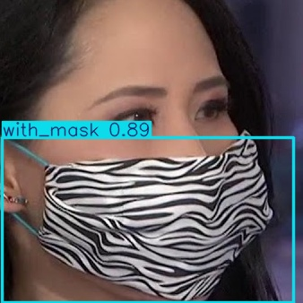

# YOLO-based Mask Detection

以 YOLOv8 建立口罩佩戴狀態偵測模型，辨識 `with_mask` 與 `without_mask` 兩類目標。

本專案源自數位影像處理課程實作，內容涵蓋影像資料整理、LabelImg 人工邊界框標註、YOLO 格式資料建置、YOLOv8 模型訓練、驗證與測試、影像推論，以及 IoU／NMS 原理實作。



## 專案重點

- 原始影像取自 Kaggle「Face Mask Detection ~12K Images Dataset」。
- 原始資料主要依 `WithMask`／`WithoutMask` 類別整理。
- 為進行物件偵測，使用 LabelImg 手動建立人臉區域與口罩狀態的邊界框標註。
- 本次實驗實際整理 2,002 張具有 YOLO 格式標註的影像。
- 資料切分為 Train 1,401 張、Validation 300 張、Test 301 張。
- 使用相同資料與 50 epochs 設定比較 YOLOv8n 與 YOLOv8s。
- 使用 Precision、Recall、mAP@50 與 mAP@50–95 評估模型。
- 以獨立 Python 程式整理訓練、評估與推論流程。
- 另行實作 IoU 與簡化版 Non-Maximum Suppression，理解偵測框篩選機制。

## 資料集與標註來源

原始影像來源：

- Ashish Jangra
- **Face Mask Detection ~12K Images Dataset**
- Kaggle：  
  https://www.kaggle.com/datasets/ashishjangra27/face-mask-12k-images-dataset

原始資料主要以 `WithMask` 與 `WithoutMask` 類別整理。

本專案為了進行 YOLO 物件偵測，另外使用 LabelImg 手動建立人臉區域的 bounding box，並依口罩佩戴狀態設定類別標籤，再整理為 YOLO 格式。

本次實驗實際使用的資料量如下：

| 子集合 | 影像數 | YOLO 標註檔數 |
|---|---:|---:|
| Train | 1,401 | 1,401 |
| Validation | 300 | 300 |
| Test | 301 | 301 |
| **總計** | **2,002** | **2,002** |

YOLO 標註類別為：

| class_id | label |
|---:|---|
| 0 | `without_mask` |
| 1 | `with_mask` |

每個標註檔皆使用 YOLO bounding-box 格式：

```text
class_id x_center y_center width height
